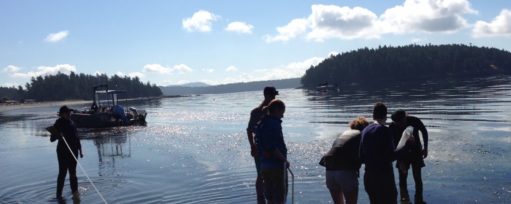

#My Research Interest

by Steven Roberts


---

I like animals in the **water**. I study the response of shellfish to environment. Most of the time I look at how gene expression changes. Here is a picture of one of the things I study.


[My Website](http://faculty.washington.edu/sr320/)


Lots of time I sit at the computer. This is stuff I type: `ls -F thesis`


```
blastn \
- query data-file \
- databese fish \
```

Here is how you _might_ be able to add a local image file



    
added line
talk about something else
 


